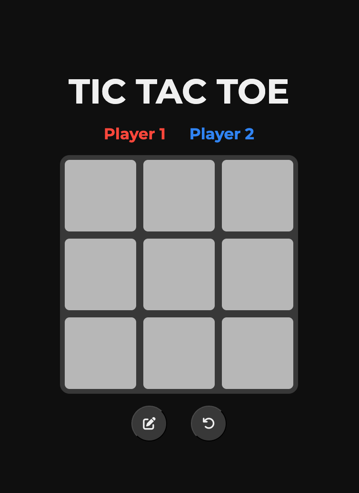
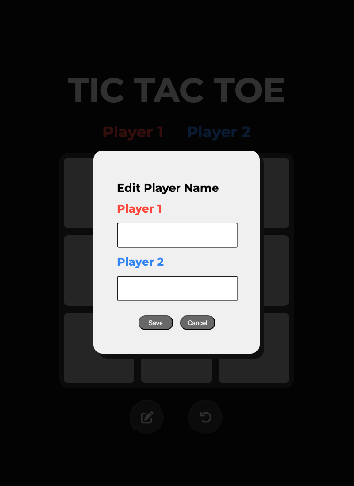

# 🎮 Tic Tac Toe Game

A browser-based Tic Tac Toe game built with HTML, CSS, and JavaScript. This project features modular code structure, interactive UI, and logic to track player turns and determine the winner.

## 🚀 Live Preview

[🔗 Click here to play](https://hieunguyen-design.github.io/tictactoe/)

## 🛠️ Built With

- **HTML** – structure of the game board and modal dialogs
- **CSS** – styling the grid, player colors, and modals
- **JavaScript** – game logic, DOM manipulation, modular pattern

## 📂 Features

- ✅ Two-player game with alternating turns
- ✅ Editable player names using a modal dialog
- ✅ Winning combinations detection (rows, columns, diagonals)
- ✅ Replay button to reset the board
- ✅ Modular code using IIFEs and Factory Functions

## 📸 Screenshots

| Game Board                                 | Modal Editing Player Names                   |
| ------------------------------------------ | -------------------------------------------- |
|  |  |

## 🧠 Key Concepts

- **Module Pattern** with IIFE (`GameBoard`, `Players`, `GamePlay`)
- **DOM manipulation** with `querySelector` and `addEventListener`
- **Game state management** using arrays and objects

## 📌 Future Improvements

- Add AI opponent (easy/medium mode)
- Store game results in localStorage
- Add animations and sound effects

## 🙏 Credits

Project inspired and guided by The Odin Project.
